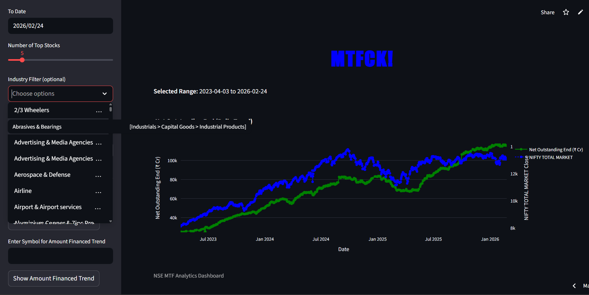
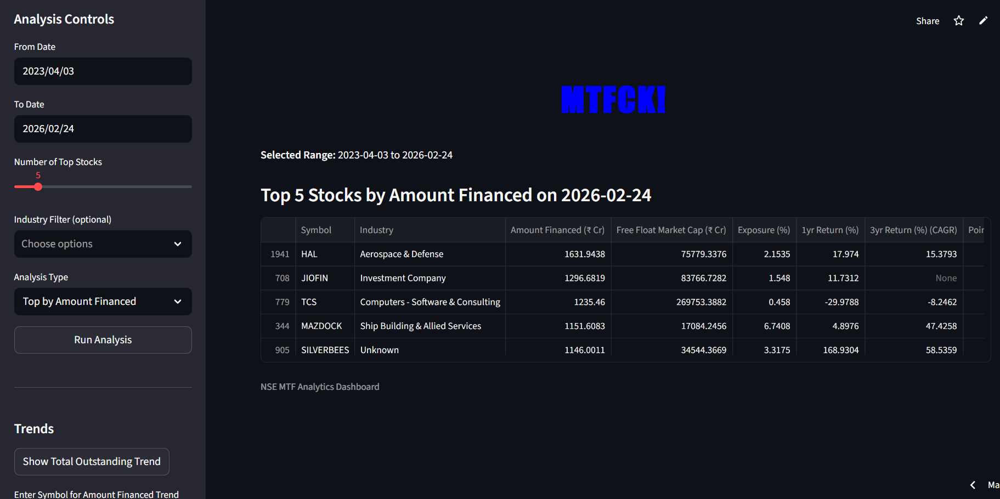
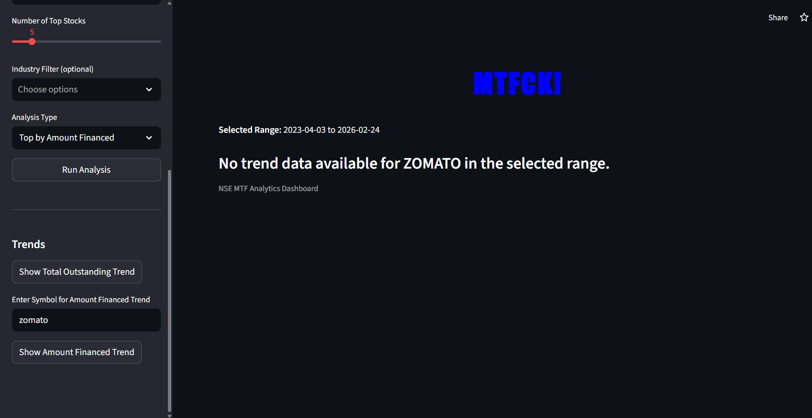
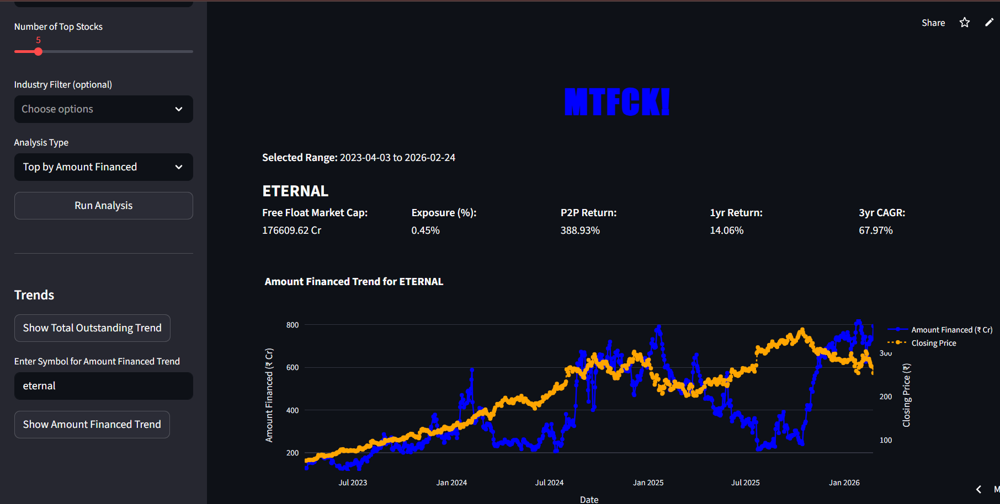

# MTFCK! (NSE MTF Analytics Dashboard)

A robust and interactive dashboard for analyzing NSE Margin Trading Facility (MTF) data. Gain insights into top stocks by amount financed, exposure percentages, returns, and interactive market trends.


## 🌟 Key Features

### 🚀 Macro level analysis
See the big picture by comparing the **Total Outstanding Market Trend** with the **NIFTY TOTAL MARKET** movement over time, allowing you to gauge the overall market leverage environment.

Provides **four-level industry filter** with granular multi-select industries. Search among 200 industries over any four levels. Choose one or more basic industries.
eg. search *Discretionary* and see all Discretionary industries and basic industries. Hover over a basic industry to understand its hierarchy



View and sort market leaders by **Amount Financed**, **% Change**, and **Exposure %**. Easily track newly added MTF stocks and deep-dive into the data using the smart industry hierarchy filters.



Exposure provided as a % of **free float market cap** to help understand the *actual* levered exposure liquidation risk

### 📈 Micro level analysis
Analyze individual stock performance by overlapping the **Amount Financed Trend** directly with the **Closing Price** to identify correlations and market leverage points. 
Leverages a robust database that keeps track of symbol changes and merges data, providing continuous, seamless data. **No fragmentation**





**Rich metadata** provided for at-a-glance preliminary decisions in all screens(returns for key time periods, exposure, free float market cap etc)

**Date range** filters respected by all functions

### Functionality-rich components:
- graphs have autosize, zoom, selection of each charts,
- tables have export functions, sortability etc

### ⚡ Under the Hood
- **Automated Data Pipeline**: Daily updates via GitHub Actions in the `MTFDB` repository.
- **Parquet Data Lake**: Uses hyper-compressed Parquet files for storage, reducing 200MB+ of raw CSV data into ~2.5MB.
- **One-Click Sync**: Synchronize your local dashboard with the latest cloud data directly from the UI.
- **Performance Optimized**: Uses DuckDB in-memory for lightning-fast analytical queries directly on Parquet files.
- **Smart Industry Filtering**: Searchable industry hierarchy for deep sector analysis.


## Usage

1. **Install dependencies**  
   ```bash
   uv sync
   ```

2. **Run the dashboard**  
   ```bash
   uv run streamlit run app.py
   ```

3. **Controls**  
   - **Sync Database**: Click "Sync Database from Cloud" in the sidebar to download the latest data.
   - **Analysis**: Select date range, industry, and analysis type, then click "Run Analysis".
   - **Trends**: Enter a symbol and click "Show Amount Financed Trend" to see historical MTF data overlapped with price.
   - **Total outstanding**: Click "Show Total Outstanding Trend" to see the market-wide leverage trend overlapped with the NIFTY Total Market index.

## Project Structure

- `app.py` - Streamlit dashboard UI and cloud sync logic.
- `src/mtfck/mtfck.py` - Core analytical logic and Just-In-Time (JIT) industry enrichment.
- `src/mtfck/ingestion.py` - Data pipeline for parsing NSE reports and managing Parquet exports.
- `src/mtfck/db.py` - Database connection manager (In-memory DuckDB mapped to Parquet).
- `mtf_data/` - Local cache for `.parquet` data files (ignored by Git).

## Tech Stack

- **UI**: Streamlit
- **Analytics**: DuckDB (In-process SQL engine)
- **Storage**: Apache Parquet (ZSTD Compressed)
- **Data Pipeline**: Python + GitHub Actions
- **Data Source**: NSE India (National Stock Exchange)

## License
MIT License
